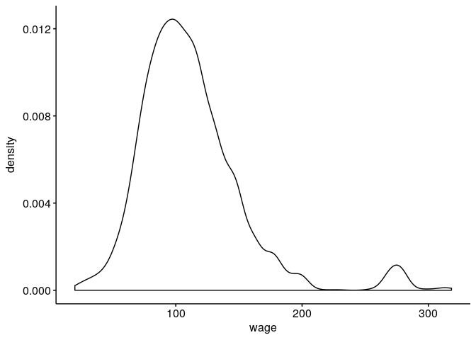
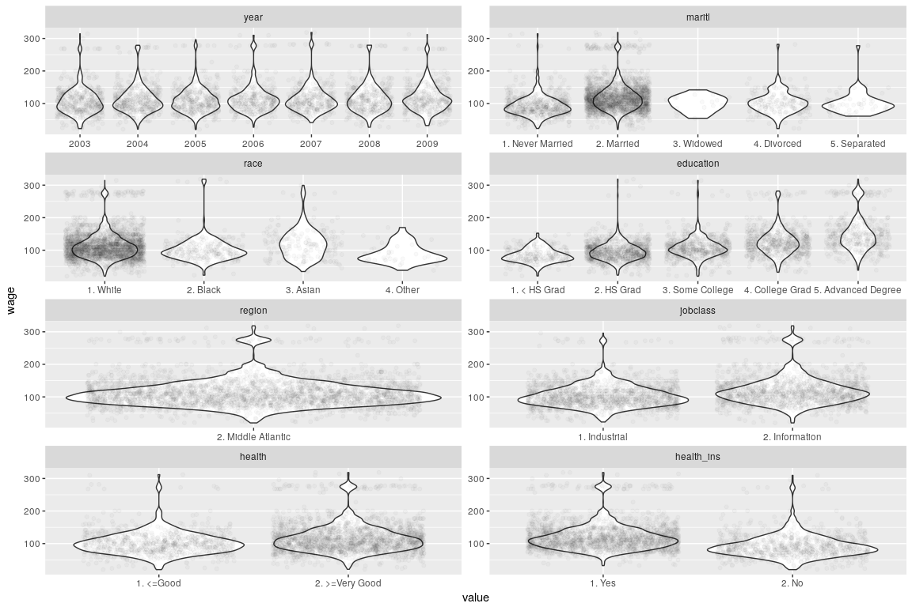
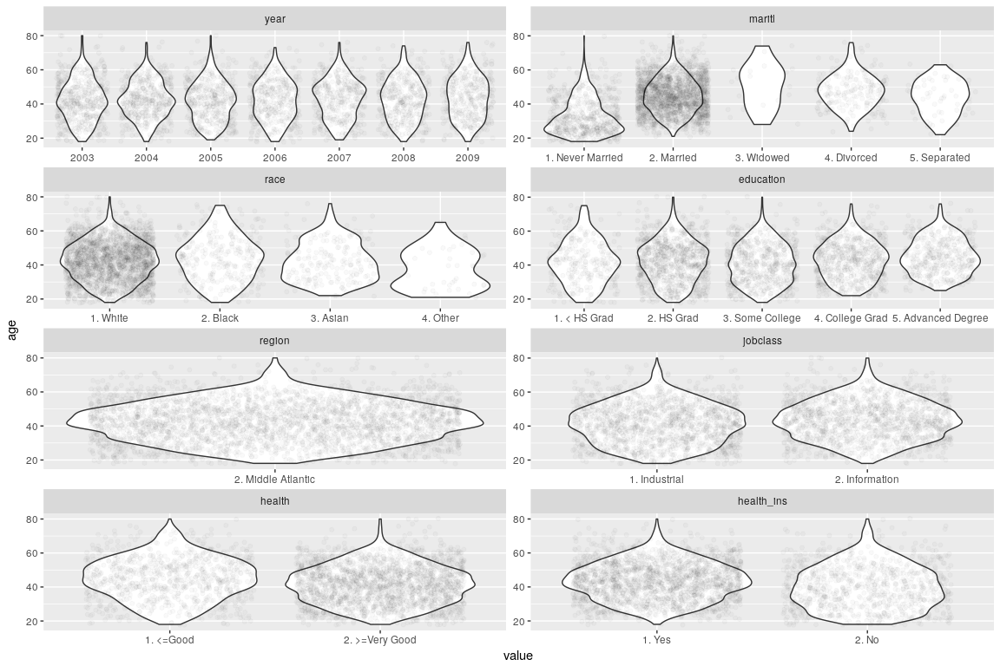
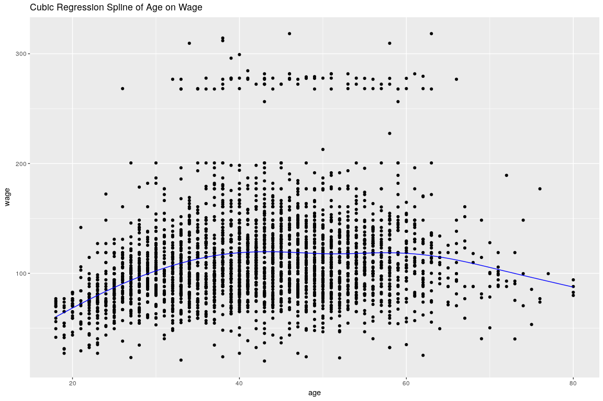
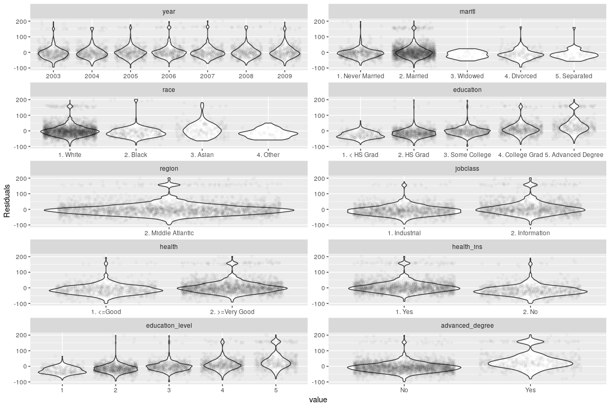
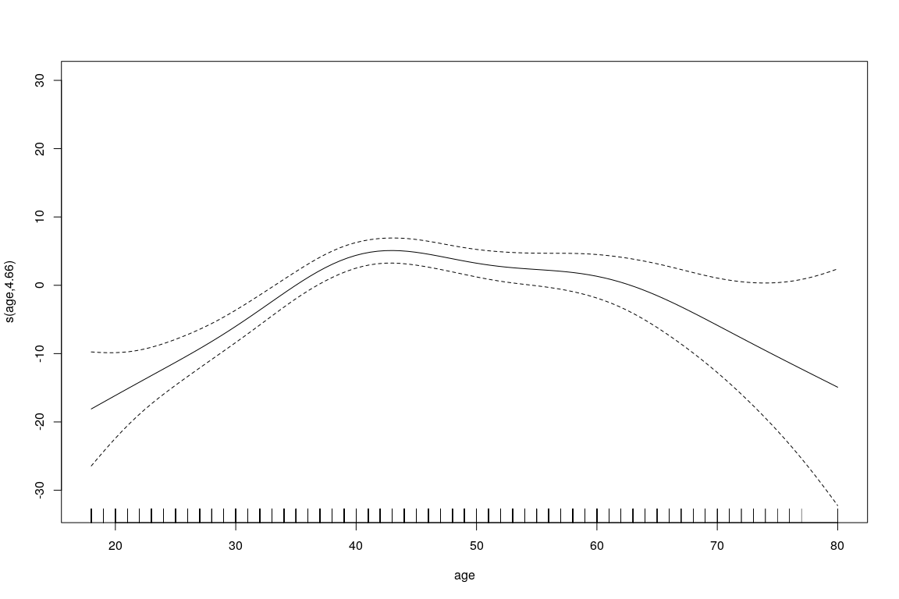
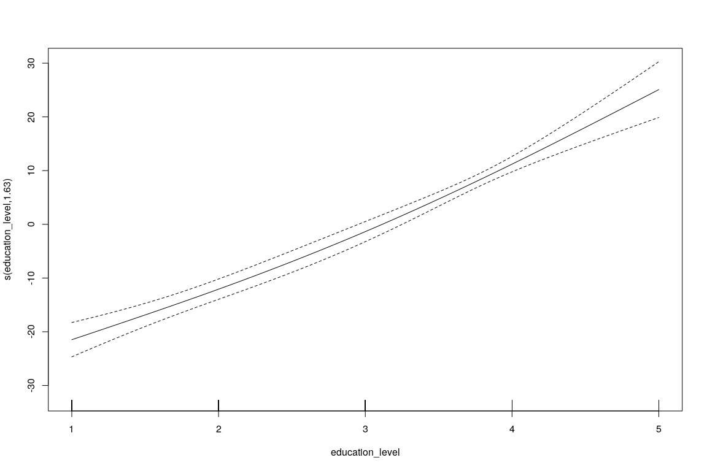
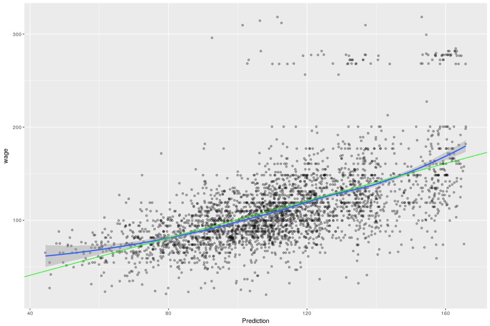
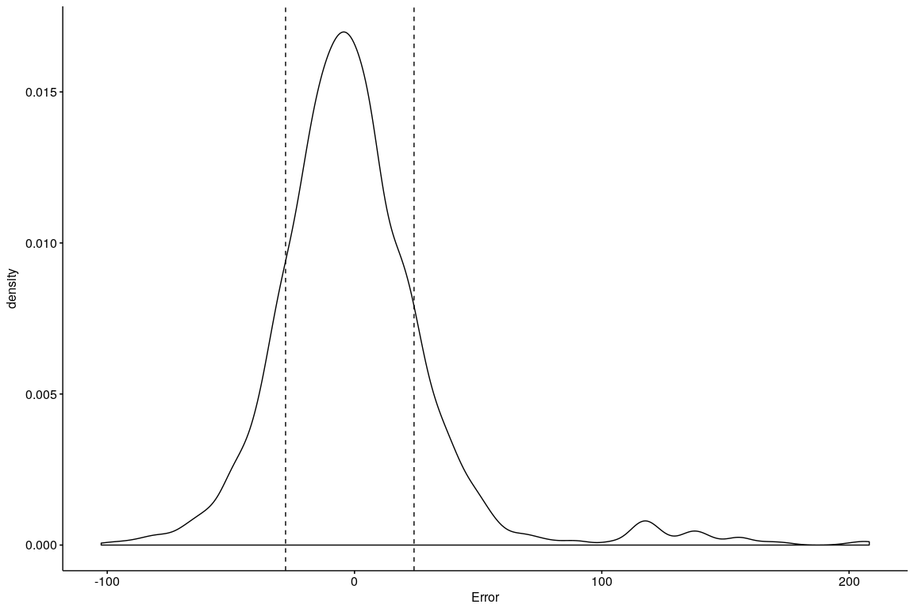

Modeling Wage Data
================
Chase Baggett

Introduction
============

I will be attempting to predict wage as a function of age and other variables using non-linear techniques.

Data
====

The data represents 300 all male workers in the Mid-Altantic from 2003 to 2009.

Analysis
========

Exploratory
-----------

The very first thing to notice about this dataset is the bimodal response. When you have a bimodal response it makes sense to see if you can separate the modes logically before proceeding onto more complex statistical techniques.

``` r
ggdensity(Wage,"wage")
```



I'm going to plot the wage variable against each of our predictors to see if there is any obvious separation.

The majority of people who are making over 250k are Married, White, College Educated, and especially with an advanced degree, more likely to work in information than industry, in good health, with health insurance.

``` r
m_dat <- melt(Wage,id.vars = "wage")
m_dat <- subset(m_dat,!variable %in% c("age","logwage"))
ggplot(m_dat,aes(y=wage,x=value)) + geom_violin() + geom_jitter(alpha=.025) + facet_wrap(~variable,scales="free",ncol = 2)
```



I am however worried that many of these variables (health, education, marriage, etc) might be related to age. If I generate the same plot by age, I can see that people of a certain age are more likely to be widowed, to have never been married, etc. In additional, being older in our data relates to being more likely to be asian.

``` r
m_dat <- melt(Wage,id.vars = "age")
m_dat <- subset(m_dat,!variable %in% c("wage","logwage"))
ggplot(m_dat,aes(y=age,x=value)) + geom_violin() + geom_jitter(alpha=.025) + facet_wrap(~variable,scales="free",ncol = 2)
```



Modeling Residuals
------------------

I am going to fit a regression using a cubic regression spline of age, and then look at the residuals of that model to understand the effect others variables might have.

``` r
data <- Wage
fit <- mgcv::gam(wage~s(age,bs="cr"),data=data)

data$Predicted <- predict(fit)
data$Residuals <- data$wage - data$Predicted
ggplot(data,aes(y=wage,x=age)) + 
  geom_point() +  
  geom_line(aes(y=Predicted,x=age),color="blue") +
  ggtitle("Cubic Regression Spline of Age on Wage")
```



Now I can take the residuals of that model and look at the remaining effect of other variables. Only a few of our variables are logical for fitting some kind of nonlinear function to. I will transform education into a continuous variable instead of a categorical one, and create a factor for advanced degree because that seems to be where all of our bimodality exists.

``` r
data$education_level <- as.numeric(substr(data$education,1,1))
data$advanced_degree <- ifelse(data$education_level == "5","Yes","No")
m_dat <- melt(data,id.vars = "Residuals")
m_dat <- subset(m_dat,!variable %in% c("age","wage","logwage","Predicted"))
ggplot(m_dat,aes(y=Residuals,x=value)) + geom_violin() + geom_jitter(alpha=.025) + facet_wrap(~variable,scales="free",ncol = 2)
```



Fitting a Final Model
---------------------

Now I am going to fit a model with 2 smooths, one for age, and one for education level.

``` r
fit <- mgcv::gam(wage~s(age) + s(education_level,k = 3) + advanced_degree + race + health_ins + maritl + year + jobclass,data=data)
par(ask=F)
plot(fit)
```



Conclusion
==========

By looking at the summmary I can see most of the variables have a significant p-value, including the two smooths. Only a few don't, and they are factor levels that have significance for other groups. However, the *R*<sup>2</sup> is not very good, which means we don't explain a great deal of the variation compared to the null model.

``` r
knitr::kable(tidy(fit))
```

| term                |       edf|    ref.df|  statistic|  p.value|
|:--------------------|---------:|---------:|----------:|--------:|
| s(age)              |  4.658681|  5.718314|   11.17145|        0|
| s(education\_level) |  1.634296|  1.866183|   90.33688|        0|

I can get an idea for the model's accuracy by plotting the actual vs predicted. I can see that thje model never predicts the bimodal group, which makes sense because we never found a variable that well described which people would get the high paying jobs beyond generallly being more likely than other groups, but still overall unlikely. The green line on the plot represents a perfect prediction at each value of wage.

``` r
data$Prediction <- predict(fit)
data$Error <- data$wage - data$Prediction 
ggplot(data,aes(y=wage,x=Prediction)) + 
  geom_point(alpha=.3) + 
  geom_smooth(method="loess") + 
  #expand_limits(x = 0, y = 0) +
  geom_abline(intercept = 1,slope = 1,color="green")
```



In addition I can calculate the RMSE as

``` r
sqrt(mean(data$Error^2,na.rm = TRUE))
```

    ## [1] 33.72472

and the absolute mean error as

``` r
mean(abs(data$Error),na.rm = TRUE)
```

    ## [1] 22.82809

Which means that my estimates tend to be within 20-30 thousand dollars accurate.

More specifically, we can see the distribution of the errors with lines for the 15th and 85th percentile.

``` r
ggdensity(data,"Error") + 
  geom_vline(xintercept = quantile(data$Error,.15),linetype="dashed") + 
  geom_vline(xintercept = quantile(data$Error,.85),linetype="dashed")
```



I am also going to use the gamclass package to perform cross-validation on the gam model I've built, and find the MSE over 10 fold cross-validation. I can see that it is only slightly higher than my original MSE, so my predictive power is intact and my model does not appear overfit.

``` r
sqrt(mean(fit.cv$resid^2,na.rm = TRUE))
```

    ## [1] 33.92353
